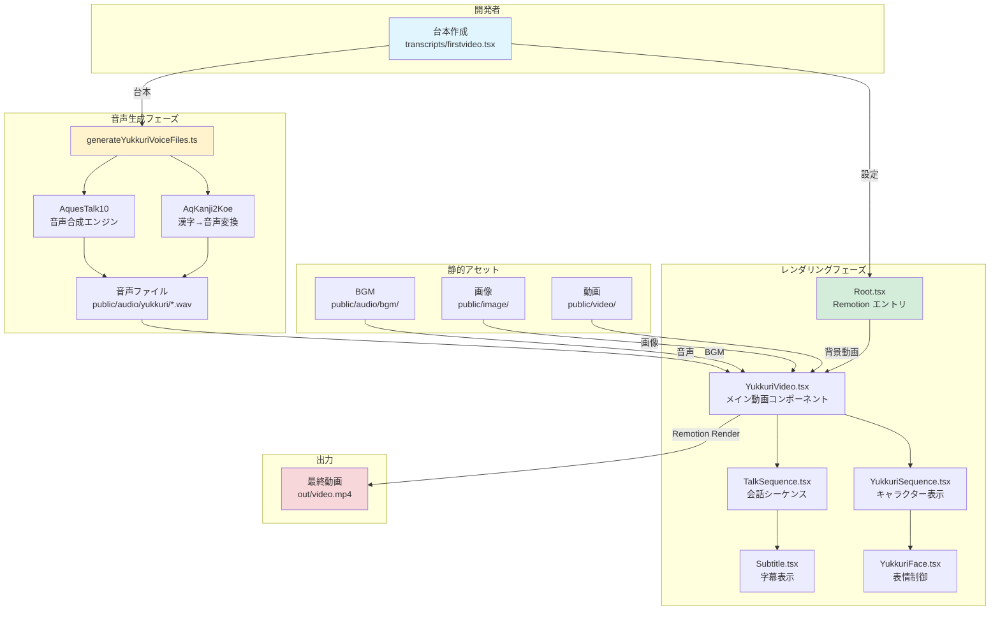
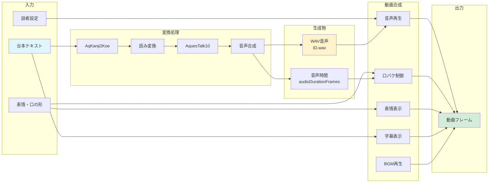
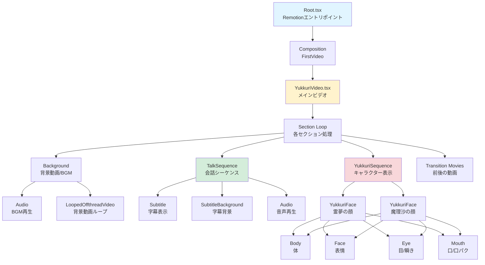
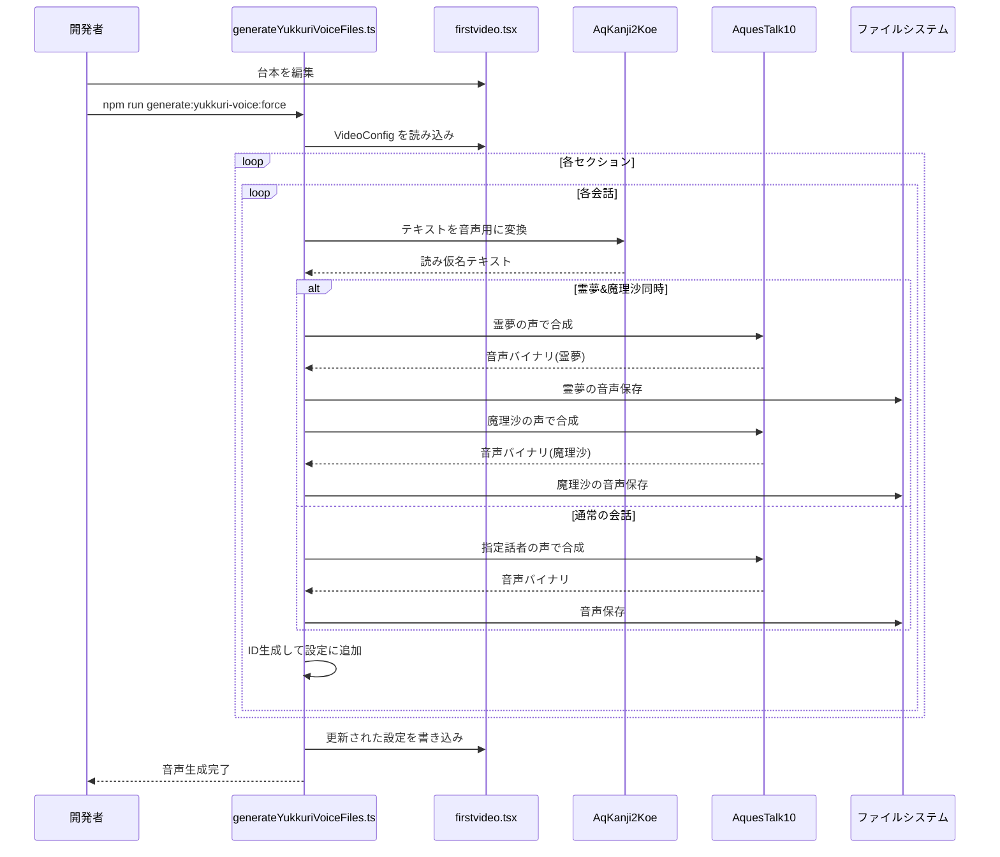
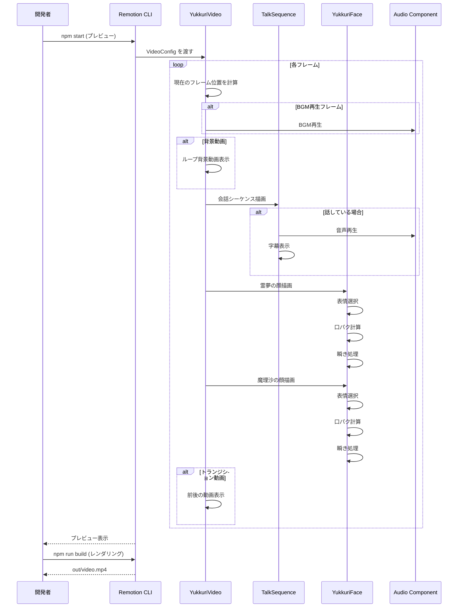
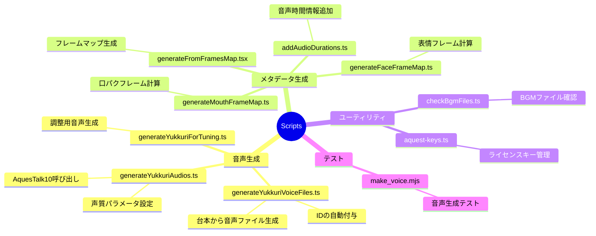
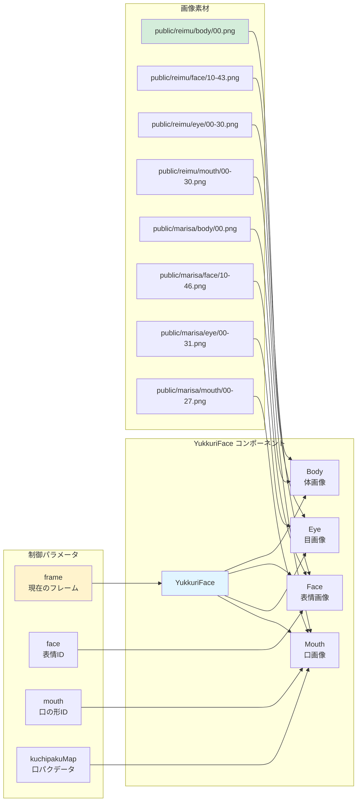
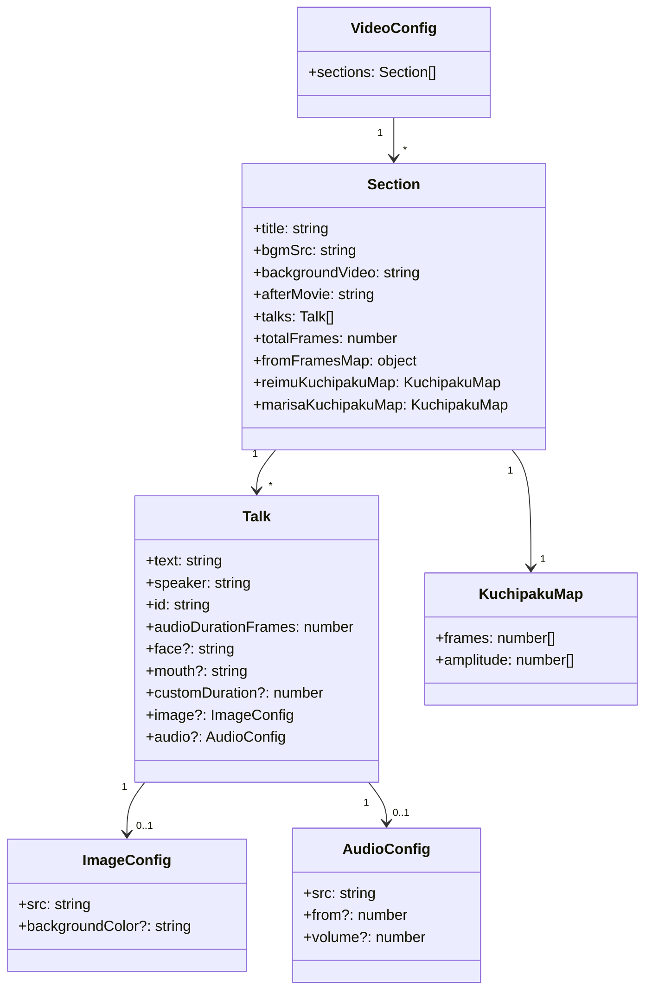
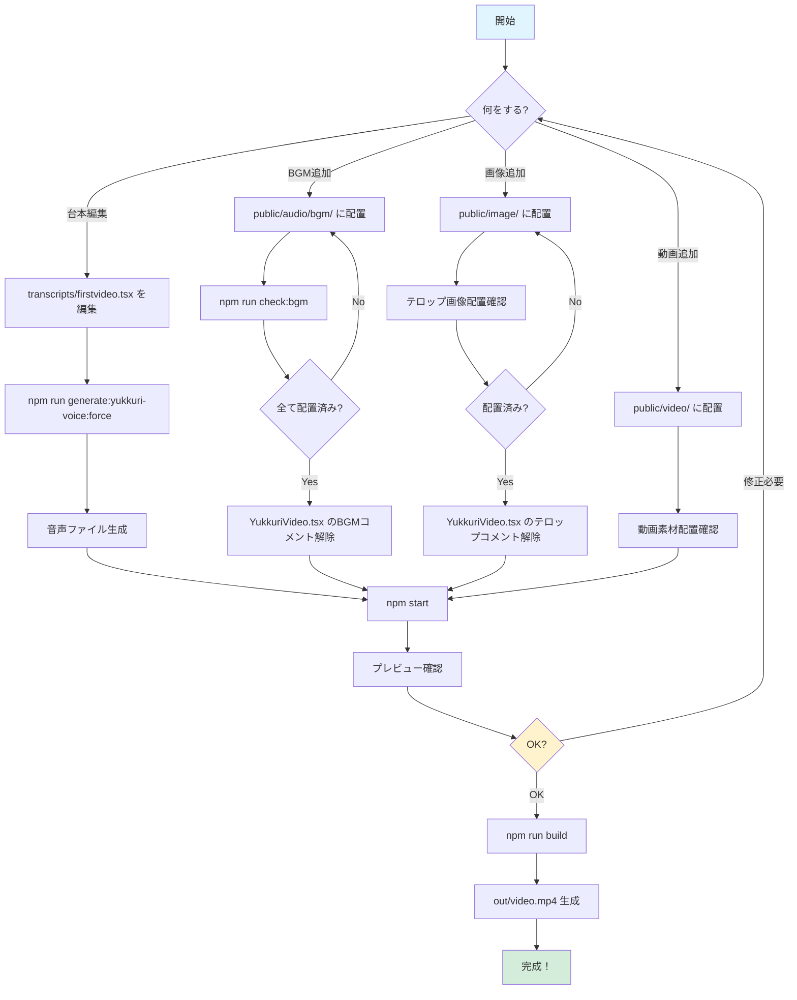

# yukkuremotion プロジェクト構成図

このドキュメントでは、Remotionを使ったゆっくり動画制作プロジェクトの構成をMermaidダイアグラムで視覚化します。

## 📊 1. 全体アーキテクチャ

## 🔄 2. データフロー図

## 📁 3. ディレクトリ構造

```mermaid
graph TD
    ROOT[yukkuremotion-playground]
    
    ROOT --> PUBLIC[public/]
    ROOT --> SRC[src/]
    ROOT --> SCRIPTS[scripts/]
    ROOT --> TRANSCRIPTS[transcripts/]
    ROOT --> VENDOR[vendor/]
    
    PUBLIC --> AUDIO[audio/]
    PUBLIC --> IMAGE[image/]
    PUBLIC --> VIDEO[video/]
    
    AUDIO --> BGM[bgm/<br/>BGMファイル]
    AUDIO --> YUKKURI[yukkuri/<br/>音声ファイル]
    AUDIO --> SOZAI[sozai/<br/>効果音]
    
    IMAGE --> TELOP[telop/<br/>テロップ画像]
    IMAGE --> IMGS[各種画像素材]
    
    VIDEO --> VIDS[背景動画素材]
    
    SRC --> COMPONENTS[components/<br/>共通コンポーネント]
    SRC --> YUKKURI_COMP[yukkuri/<br/>ゆっくり関連]
    SRC --> SUBTITLE[Subtitle/<br/>字幕コンポーネント]
    SRC --> UTILS[utils/<br/>ユーティリティ]
    
    YUKKURI_COMP --> FACE[Face/<br/>表情管理]
    YUKKURI_COMP --> TALK[Talk/<br/>会話シーケンス]
    
    SCRIPTS --> GEN_AUDIO[generateYukkuriAudios.ts<br/>音声生成]
    SCRIPTS --> GEN_VOICE[generateYukkuriVoiceFiles.ts<br/>音声ファイル生成]
    SCRIPTS --> CHECK_BGM[checkBgmFiles.ts<br/>BGMチェック]
    SCRIPTS --> KEYS[aquest-keys.ts<br/>ライセンスキー]
    
    TRANSCRIPTS --> CONFIG[firstvideo.tsx<br/>動画設定・台本]
    TRANSCRIPTS --> CUSTOM[CustomObjects.tsx<br/>カスタムオブジェクト]
    
    VENDOR --> AQUEST[AquesTalk.framework]
    VENDOR --> KANJI[AqKanji2Koe.framework]
    VENDOR --> DIC[aq_dic_large/]
    
    style ROOT fill:#e1f5ff
    style PUBLIC fill:#fff3cd
    style SRC fill:#d4edda
    style SCRIPTS fill:#f8d7da
    style TRANSCRIPTS fill:#d1ecf1
```

## 🎬 4. Remotion コンポーネント階層

## ⚙️ 5. 音声生成プロセス

## 🎨 6. レンダリングプロセス

## 🔧 7. 主要スクリプトと役割

## 🎭 8. キャラクター（ゆっくり）の構成

## 📝 9. VideoConfig データ構造

## 🚀 10. 開発・ビルドフロー

---

## 📚 図の説明

### 1. 全体アーキテクチャ
プロジェクト全体の構成と各フェーズの関係を示します。

### 2. データフロー
テキストから音声、そして動画フレームまでのデータの流れを示します。

### 3. ディレクトリ構造
プロジェクトのファイル・ディレクトリの階層構造を示します。

### 4. Remotion コンポーネント階層
React/Remotionコンポーネントの親子関係を示します。

### 5. 音声生成プロセス
音声ファイル生成のシーケンスを時系列で示します。

### 6. レンダリングプロセス
動画レンダリング時の処理フローを時系列で示します。

### 7. 主要スクリプトと役割
scripts/ ディレクトリ内の各スクリプトの役割を整理します。

### 8. キャラクター構成
ゆっくりキャラクターの画像レイヤー構造を示します。

### 9. VideoConfig データ構造
設定データのクラス図を示します。

### 10. 開発・ビルドフロー
開発からビルドまでの作業フローを示します。

---

## 🔗 関連ドキュメント

- [QUICKSTART.md](QUICKSTART.md) - クイックスタートガイド
- [SETUP_GUIDE.md](SETUP_GUIDE.md) - セットアップガイド
- [BGM_DOWNLOAD_GUIDE.md](BGM_DOWNLOAD_GUIDE.md) - BGMダウンロード手順
- [MAKE_VOICE_GUIDE.md](MAKE_VOICE_GUIDE.md) - 音声生成テストガイド

